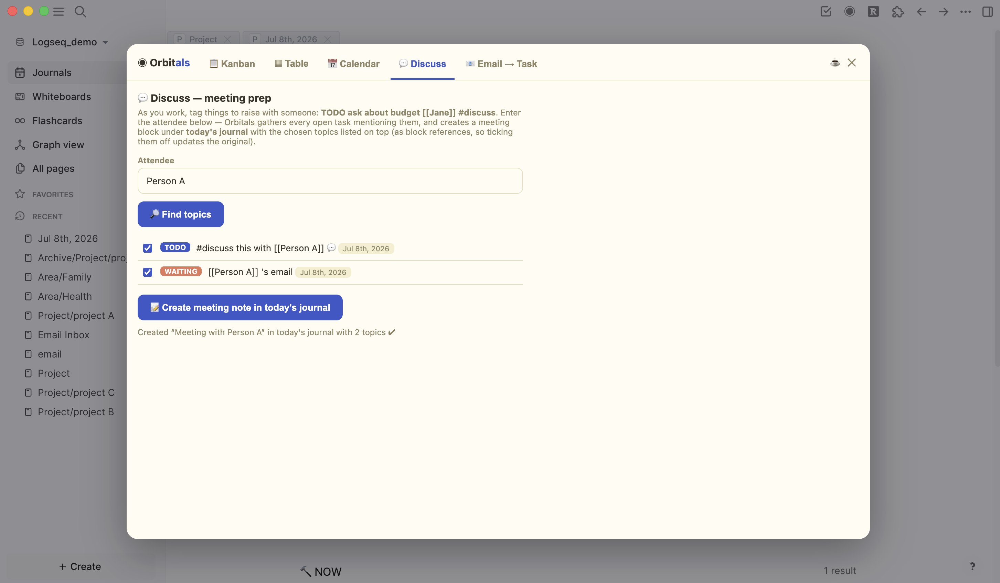

# Orbitals — a Logseq plugin for email-driven task management

*by yfhuang7* · If Orbitals makes your day smoother, you can [☕ buy me a coffee](https://buymeacoffee.com/yufenasyourfriend)!

Adds a **◉ button to Logseq's toolbar** that opens a board over your *existing* Logseq tasks — no separate database. Anything you mark `TODO`, `DOING`, `NOW`, `LATER`, `WAITING`, or `DONE` anywhere in your graph shows up automatically.

## The four views

- **Kanban** — columns To Do / Doing / Waiting (no Done column keeping things tidy — finish a task via its dropdown → DONE; completed tasks remain in Table → All tasks). Drag a card and the plugin rewrites the keyword in your actual note. Click a card title to jump to that block in Logseq.
- **Table** — works like Tana supertags, driven by page-name prefixes:
  - **A tab per type, auto-detected**: every namespaced page in your graph — `project/…`, `area/…`, `resources/…`, `archive/…`, anything — gets a tab for its type and a row in it, **even with zero tasks** (a page directory, like Tana's supertag views). A task counts toward a project **either** by living on that page **or** by linking to it — writing `TODO draft agenda [[project/Sept Event]]` on your journal works exactly like Tana tagging. Columns: To Do / Doing / Waiting / Done counts, % done progress bar, next upcoming date, overdue count — and **each page property gets its own sortable column** (add `client:: Acme`, `status:: active`, `deadline-journal:: …` at the top of the page). Click a name to open its page; **📋 Board** filters the Kanban to it.
  - **☑ All tasks**: every task in a sortable flat table.
- **Filters** — Kanban, Calendar and both tables share a collapsible **🔍 Filter** button. Expand it to filter two ways, separately or combined:
  - **By project** — pick one project's tasks. Journal (daily) pages and template pages are excluded from the list to keep it short.
  - **By project status** — pick a `status::` value (e.g. `active`, `on-hold`) and you see only tasks/projects whose page has that status. Set it once per project page: first line `status:: active`. Choosing a status also narrows the project list to matching projects.
- **Calendar** — shows more than scheduled tasks: TODOs written on a **journal page** appear on that day automatically, and an **📥 Unscheduled TODOs** panel (collapsible) lists every open task with no date so nothing slips through. Opens on a **weekly task planner** (like Agenda's Tasks view): a column per day with a progress bar, tick-to-complete checkboxes (done tasks strike through and drop to the bottom), and a **＋ Add a task** box per day — new tasks land on that day's journal page with a `SCHEDULED:` date, so they show in Logseq and the Agenda plugin too. Toggle to a **Month** grid anytime. Tasks appear on their `SCHEDULED:`/`DEADLINE:` date (⚑ = deadline); with the Google bridge connected, your **Google Calendar events** appear in both views (green outlined 🗓 chips with start times; next 6 weeks, read-only).
- **Discuss** — Tana-style meeting prep. While working, tag anything you want to raise with someone: `TODO ask about budget [[Jane]] #discuss`. Before the meeting, open Discuss and type `Jane` — every open task mentioning her is listed (💬 #discuss ones first). Tick what to cover → **Create meeting note** adds a `Meeting with [[Jane]] #meeting` block to **today's journal page** with the topics on top as block references, so checking one off during the meeting updates the original task everywhere.
- **Email → Task** — two ways:
  - **Gmail auto-import**: label any email **`logseq`** in Gmail and it appears here as a TODO on your **"Email Inbox"** page — with sender, date, a snippet, and an **📧 Gmail ↗** button on the card that opens the original email. Syncs automatically every time you open the board (one-time setup below). The label flips to `logseq/added` so nothing imports twice.
  - **Paste manually**: paste subject/sender/body, choose To Do or **Waiting**.
  - Either way, add subtasks the Logseq way: indent lines under the task (`TODO chase them next week`, etc.).

## Install (~2 minutes, no coding)

1. In Logseq: **⋯ (top-right) → Settings → Advanced → turn ON "Developer mode"**.
2. **⋯ → Plugins → Load unpacked plugin**.
3. Select this folder. Done — the ◉ Orbitals button appears in the toolbar.
4. (Optional) Move this folder somewhere permanent first (e.g. `Documents/logseq-plugins/`), because Logseq loads it from wherever it lives. If you move it later, just remove and re-load the plugin.

Also available from the command palette: `Ctrl/Cmd-Shift-P → "Orbitals: open"`. The panel follows Logseq's light/dark theme. Close with ✕, Esc, or clicking outside.

## Connect Gmail (~10 minutes, one time)

Why a "bridge"? Google's sign-in can't run inside a Logseq plugin, so instead a tiny script in **your own Google account** hands labeled emails to the plugin. No passwords are shared; nothing leaves your account except to your own Logseq.

1. Go to **https://script.google.com** → **＋ New project** → name it `Orbitals Gmail Bridge`.
2. Delete the placeholder code and paste in the contents of **`gmail-bridge.gs`** (in this folder).
3. In the code, change `SECRET = 'change-me-to-something-random'` to any random text you invent (this is the password protecting your bridge). Save (Cmd/Ctrl-S).
4. Click **Deploy → New deployment** → ⚙️ type **Web app** → Execute as **Me** → Who has access **Anyone** → **Deploy**. Authorize when asked (Google will warn it's "unverified" — normal for your own script → Advanced → Go to Orbitals Gmail Bridge).
5. Copy the web app URL and add your secret to the end, like:
   `https://script.google.com/macros/s/…/exec?key=your-secret-here`
6. In Gmail, create a label called **`logseq`** (left sidebar → Labels → ＋).
7. In Logseq: ▦ → **Email → Task** tab → paste that full URL into "Bridge URL" → **Save** → **Sync now**.

From then on: label an email `logseq` → open the board → it's a task. ("Anyone with the link + your secret" can call the bridge, so keep the URL private; it can only *read* the 20 newest labeled emails and your calendar events — never send, delete or change anything.)

**Google Calendar** rides on the same bridge — no extra URL. If you set the bridge up before Calendar support existed: paste the newest `gmail-bridge.gs` over the old code, then **Deploy → Manage deployments → ✏️ → Version: New version → Deploy**, and approve the Calendar permission when Google asks.

**Choosing which calendars sync**: near the top of `gmail-bridge.gs` there's `var CALENDARS = [];`. Empty = your default calendar only. To sync specific ones, list their names, e.g. `var CALENDARS = ['Work', 'Family'];`. Not sure of the names? Open `<your-bridge-url>&action=calendars` in a browser to list them all. Redeploy (New version) after editing.

**Weekly time box**: the Week view shows a second row with hour lines (06:00–18:00) where timed Google Calendar events appear at their actual time and duration; all-day events stay in the day's task column.

## Suggested email workflow

1. Email arrives that needs action → in Gmail, apply the **`logseq`** label. That's it.
2. Open the board in Logseq → the email is now a TODO card with an **📧 Gmail ↗** link back to the thread.
3. Replied and now waiting on them? Drag the card to **Waiting**.
4. Click the card title to jump to the block: add indented `TODO` subtasks, a `/Deadline`, or notes.
5. Glance at **Kanban** daily: the Waiting column is your "chase these people" list.

## Notes & limits

- Works on desktop Logseq (plugins aren't supported in the mobile app).
- Uses your normal markers, so it plays nicely with Logseq's own queries, repeated tasks, and the journal.
- If you use the NOW/LATER workflow, those markers appear in the Doing/To Do lanes; moving a card writes TODO/DOING/WAITING/DONE.
- The Done column shows the 25 most recent to stay fast on big graphs.
- Requires internet on first launch after Logseq restarts (the plugin library loads from a CDN). Ask Claude to bundle it offline if that ever bothers you.

## Changing it

The whole plugin is one file, `index.html`. Open a Claude/Cowork session on this folder and describe what you want — e.g. "add a CANCELED lane" or "show the [#A] priority on cards".
